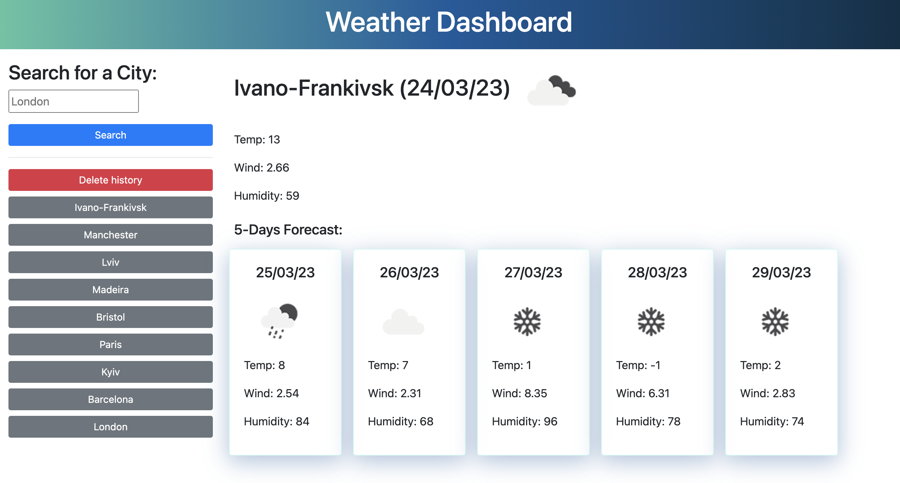

# 5 Day Weather Forecast Application

## Description
 5 Day Weather Forecast - is a JavaScript application, that allows user to search for a city weather forecast, and be presented with current condition and condition for the next five days for that city and that city is added to the search history. To retrieve weather forecast data was used Open Weather API, that allows user to view weather conditions such as: 
 * The city name
 * The date
 * An icon representation of weather conditions
 * The temperature
 * The humidity
 * The wind speed 

## Table of Contents
* [App in action](#app-in-action-images)
* [Installation](#Installation)
* [Usage](#Usage)
* [License](#License)
* [Contributing](#Contributing)
* [Questions](#Questions)

## App in action (images)

## Installation
This application is able to run inside the browser, you won't need to install anything to run this app.
To deploy, simply follow the URL and begin searching: 

## Usage
To search for a city weather forecast, enter city name in the input field and press on `blue button "Search"`. After that, the `grey button` with searched city name on it will be created. You can press on that button, if you want to view weather forecast of priviosly searched city again. To delete searched history press on `red button "Delete history"`.

## License
This project is licensed under the MIT license.

## Contributing 
Fork and pull request

## Questions
If you have any questions about the repo, open an issue or contact directly at ivanna.kuliak@gmail.com 
You can find more of my works at: 
[github.com/Ivanna0803](https://github.com/Ivanna0803)

